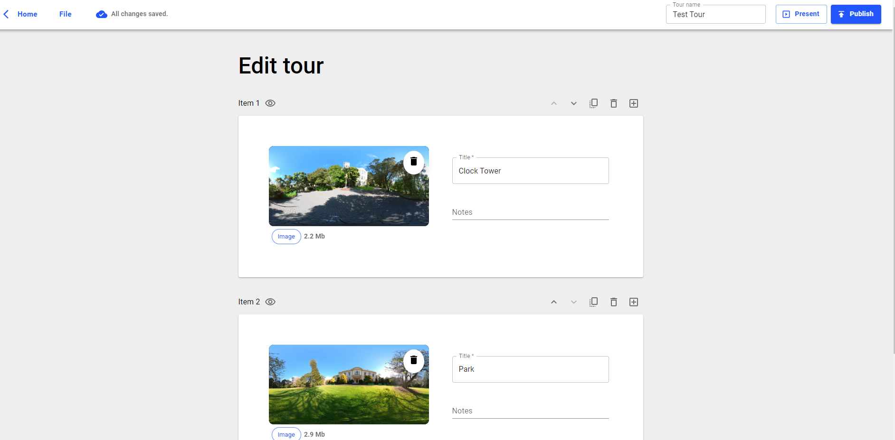

<!-- ABOUT THE PROJECT -->

# Jitsi Admin



Tour authoring tool allowing tour guides to upload and manage 360 Videos and Images. The frontend is built using React and Material UI hosted using AWS Amplify. Backend is built using AWS Lambda, S3, and DynamoDB.

### Built With
#### Frontend:
- [![React][react.js]][react-url]
- [![MUI][mui]][mui-url]

#### Backend:
- [![AWS][aws-img]][aws-url]
- [![DynamoDB][dynamoDB-img]][mui-url]

<p align="right">(<a href="#top">back to top</a>)</p>

<!-- GETTING STARTED -->

## Getting Started

### Prerequisites

You need to have npm installed on your local machine.

You will AWS amplify CLI to pull the backend

### Installation

1. Clone the repo
   ```sh
   git clone https://github.com/your_username_/Project-Name.git
   ```
2. Install NPM packages
   ```sh
   npm install
   ```
3. Run the frontend using 
   ```sh
   npm start
   ```
<!-- LICENSE -->

## License

Distributed under the MIT License. See `LICENSE.txt` for more information.

<!-- CONTACT -->

## Contact

Tony Cui - Tonycui02@mgail.com


<!-- ACKNOWLEDGMENTS -->

## Acknowledgments

- [Img Shields](https://shields.io)

<p align="right">(<a href="#top">back to top</a>)</p>

<!-- MARKDOWN LINKS & IMAGES -->
<!-- https://www.markdownguide.org/basic-syntax/#reference-style-links -->

[contributors-shield]: https://img.shields.io/github/contributors/othneildrew/Best-README-Template.svg?style=for-the-badge
[contributors-url]: https://github.com/othneildrew/Best-README-Template/graphs/contributors
[react.js]: https://img.shields.io/badge/React-20232A?style=for-the-badge&logo=react&logoColor=61DAFB
[react-url]: https://reactjs.org/
[mui]: https://img.shields.io/badge/Material--UI-0081CB?style=for-the-badge&logo=material-ui&logoColor=white
[mui-url]: https://mui.com/
[aws-img]: https://img.shields.io/badge/Amazon_AWS-232F3E?style=for-the-badge&logo=amazon-aws&logoColor=white
[aws-url]: https://aws.amazon.com/
[dynamoDB-img]: https://img.shields.io/badge/Amazon%20DynamoDB-4053D6?style=for-the-badge&logo=Amazon%20DynamoDB&logoColor=white
[dynamoDB-url]: https://aws.amazon.com/
